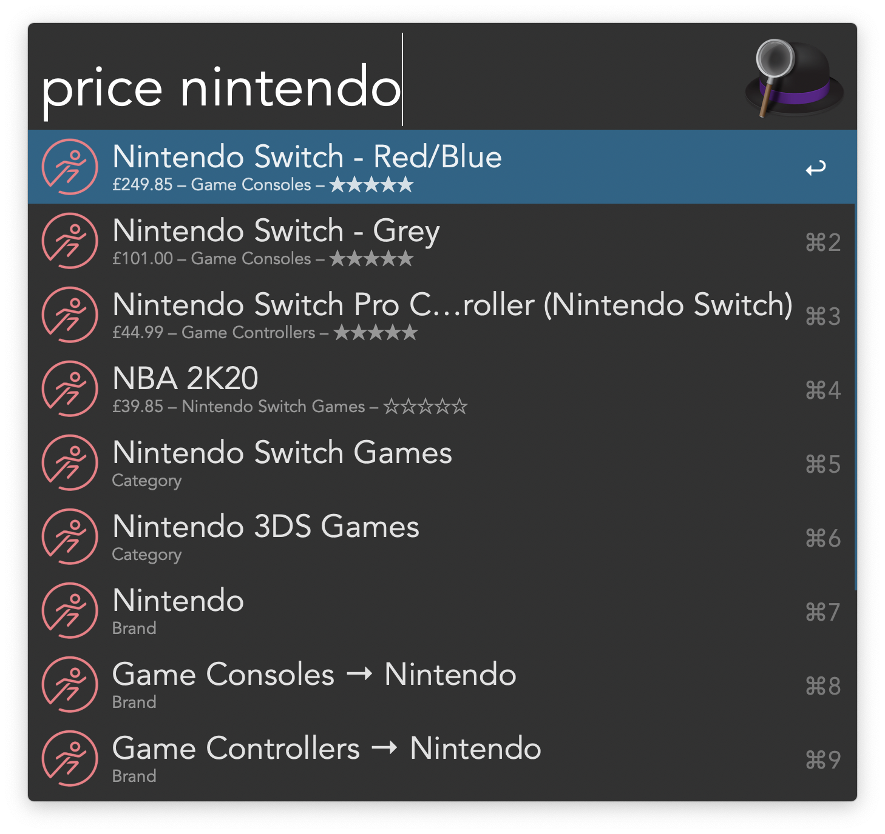

# PriceRunner Workflow for Alfred

An [Alfred](https://www.alfredapp.com) workflow for querying
[PriceRunner](https://www.pricerunner.com). You need to purchase the [Alfred
Powerpack](https://www.alfredapp.com/powerpack/) to use this workflow.

## Features

* Look up prices as you type.
* Supports several languages and currencies.
* <kbd>Cmd</kbd> + <kbd>L</kbd> displays product name and price in large type.

## Usage

Type the keyword `price` into alfred followed by a search string.

## Installing

Download the workflow from the [releases
page](https://github.com/sniarn/alfred-pricerunner-workflow/releases) and
import it into Alfred.

## Configuration

You can change the language the uses by changing the `COUNTRY` workflow
variable. Valid values are (as of this writing):

* `uk`
* `dk`
* `se`

## Thanks

* [PriceRunner](https://www.pricerunner.com)
* [Alfred-Workflow](http://www.deanishe.net/alfred-workflow/)
